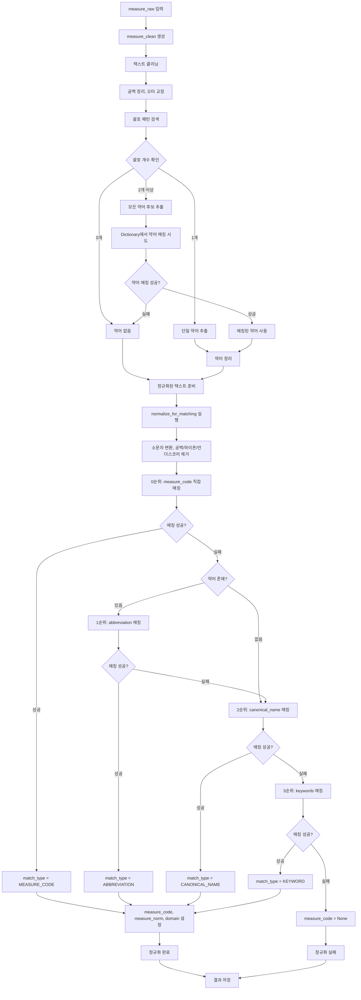
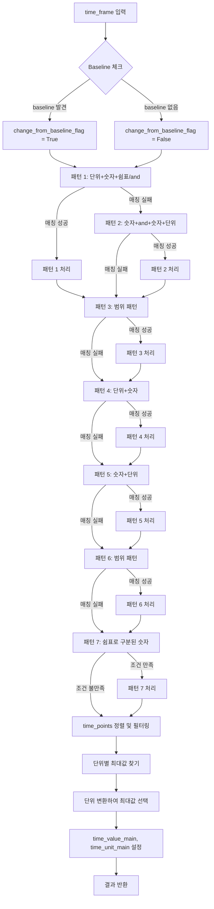

# Time Frame 파싱 정규식 패턴 가이드

## 목차

1. [Measure Code 정규화 플로우](#measure-code-정규화-플로우)
2. [개요](#개요)
3. [처리 플로우](#처리-플로우)
4. [패턴 상세 설명](#패턴-상세-설명)
5. [단위 정규화](#단위-정규화)
6. [최종 처리 로직](#최종-처리-로직)
7. [예시 모음](#예시-모음)

---

## Measure Code 정규화 플로우



### 약어 추출 로직

1. **괄호 패턴 검색**: `measure_raw`에서 괄호 안의 텍스트 추출

   - 예: `"Epworth Sleepiness Scale (ESS)"` → `"(ESS)"`

2. **괄호 개수에 따른 처리**:
   - **0개**: 약어 없음, 다음 단계로 진행
   - **1개**: 해당 약어를 `measure_abbreviation`으로 설정
   - **2개 이상**: 모든 약어 후보를 Dictionary에서 매칭 시도
     - 매칭 성공한 약어를 `measure_abbreviation`으로 설정
     - 매칭 실패 시 약어 없음으로 처리

### 매칭 우선순위

1. **0순위: measure_code 직접 매칭**

   - `measure_clean`을 정규화한 값과 dictionary의 `measure_code`를 정규화한 값 비교
   - 완전 일치 시 매칭 성공
   - `match_type = 'MEASURE_CODE'`
   - **가장 우선순위가 높음**

2. **1순위: abbreviation 매칭**

   - `measure_abbreviation`이 추출된 경우에만 시도
   - dictionary의 `abbreviation`과 비교
   - 완전 일치 시 매칭 성공
   - `match_type = 'ABBREVIATION'`
   - **약어가 없는 경우 2순위로 건너뜀**

3. **2순위: canonical_name 매칭**

   - dictionary의 `canonical_name`과 비교
   - 완전 일치 시 매칭 성공
   - `match_type = 'CANONICAL_NAME'`

4. **3순위: keywords 매칭**
   - dictionary의 `keywords` (세미콜론으로 구분)와 비교
   - 각 키워드를 정규화하여 `measure_clean`과 완전 일치 확인
   - 완전 일치 시 매칭 성공
   - `match_type = 'KEYWORD'`
   - **최후의 수단**

### 정규화 함수 (`normalize_for_matching`)

- 소문자 변환
- 공백, 하이픈, 언더스코어 제거
- 특수문자 제거 (알파벳, 숫자만 남김)

**예시**:

- `"Epworth Sleepiness Scale"` → `"epworthsleepinessscale"`
- `"ESS"` → `"ess"`
- `"Epworth-Sleepiness-Scale"` → `"epworthsleepinessscale"`

### 매칭 결과

**성공 시**:

- `measure_code`: dictionary의 `measure_code`
- `measure_norm`: dictionary의 `canonical_name`
- `domain`: dictionary의 `domain`
- `match_type`: 매칭 방법 ('MEASURE_CODE', 'ABBREVIATION', 'KEYWORD', 'CANONICAL_NAME')
- `match_keyword`: 매칭에 사용된 키워드

**실패 시**:

- `measure_code = None`
- `match_type = None`
- `match_keyword = None`
- `failure_reason = 'MEASURE_CODE_FAILED'` (timeframe도 실패 시 `'BOTH_FAILED'`)

---

## 개요

`parse_multiple_timepoints()` 함수는 ClinicalTrials.gov의 `time_frame_raw` 텍스트를 파싱하여 구조화된 데이터로 변환합니다.

### 정규화 프로세스

1. **정규화 단계**: 모든 데이터를 `outcome_normalized` 테이블에 저장 (제외 없음)

   - 성공/실패 여부와 관계없이 모든 outcome을 정규화 시도
   - `failure_reason` 컬럼에 실패 이유 기록 (성공 시 NULL)

2. **분리 단계**: `separate_normalized_data.py` 실행
   - `outcome_normalized_success`: `measure_code IS NOT NULL AND failure_reason IS NULL`
   - `outcome_normalized_failed`: `measure_code IS NULL OR failure_reason IS NOT NULL`

### 입력

- `time_frame`: 문자열 (예: "Days 84, 169, 253, 421, 505, 589, and 757")

### 출력

```python
{
    'time_value_main': int or float,  # 최대값
    'time_unit_main': str,             # 단위
    'time_points': [                   # 모든 시점 리스트
        {'value': 84, 'unit': 'day'},
        {'value': 169, 'unit': 'day'},
        ...
    ],
    'change_from_baseline_flag': bool  # baseline 포함 여부
}
```

---

## 처리 플로우



---

## 패턴 상세 설명

### 패턴 우선순위 및 실행 순서

패턴은 **우선순위 순서대로** 처리됩니다. 각 패턴은 순차적으로 실행되며, 이전 패턴에서 처리되지 않은 경우에만 다음 패턴이 실행됩니다.

**실행 순서**:

1. **패턴 1**: 단위가 앞에 오는 복수 시점 패턴 (최우선)

   - 매칭 성공 시: 패턴 1 처리 후 → 패턴 3으로 이동
   - 매칭 실패 시: 패턴 2로 이동

2. **패턴 2**: "and"로 연결된 시점 (패턴 1에서 처리되지 않은 경우만)

   - 매칭 성공 시: 패턴 2 처리 후 → 패턴 3으로 이동
   - 매칭 실패 시: 패턴 3으로 이동

3. **패턴 3**: 범위 패턴 (단위 + 숫자-숫자)

   - 매칭 성공 시: 패턴 3 처리 후 → 패턴 4로 이동
   - 매칭 실패 시: 패턴 4로 이동

4. **패턴 4**: 단위 + 숫자

   - 매칭 성공 시: 패턴 4 처리 후 → 패턴 5로 이동
   - 매칭 실패 시: 패턴 5로 이동

5. **패턴 5**: 숫자 + 단위

   - 매칭 성공 시: 패턴 5 처리 후 → 패턴 6으로 이동
   - 매칭 실패 시: 패턴 6으로 이동

6. **패턴 6**: 범위 패턴 (숫자-숫자 + 단위)

   - 매칭 성공 시: 패턴 6 처리 후 → 패턴 7로 이동
   - 매칭 실패 시: 패턴 7로 이동

7. **패턴 7**: 쉼표로 구분된 숫자만 있는 경우 (최후)
   - 조건 만족 시: 패턴 7 처리
   - 조건 불만족 시: time_points 정렬 및 필터링으로 이동

---

### 패턴 1: 단위가 앞에 오는 복수 시점 패턴

**우선순위**: 1 (최우선)

**설명**: 단위가 앞에 오고, 그 뒤에 쉼표나 "and"로 구분된 여러 숫자가 있는 패턴

#### 패턴 1-1: 쉼표 + "and" 포함

**정규식**:

```regex
\b(week|weeks|day|days|month|months|year|years|hour|hours|hr|hrs|min|mins|minute|minutes)\s+\d+(?:\s*\([^)]*\))?(?:\s*,\s*\d+(?:\s*\([^)]*\))?)*(?:\s*,\s*)?\s+and\s+\d+(?:\s*\([^)]*\))?
```

**커버하는 패턴**:

- `Days 84, 169, 253, 421, 505, 589, and 757`
- `Weeks 13, 37 (Pre-dose), 53, 77 and 105`
- `weeks 9, 17, 25 and 37`
- `days 1, 3, 7 and 14`

**처리 로직**:

1. 매칭된 텍스트에서 단위 추출
2. 첫 번째 숫자 추출 (단위 바로 뒤)
3. 쉼표로 구분된 숫자들 추출
4. "and" 뒤의 숫자 추출 (매칭된 텍스트 + 원본 텍스트에서 추가 검색)
5. 모든 숫자를 해당 단위로 `time_points`에 추가

**예시**:

```
입력: "Days 84, 169, 253, 421, 505, 589, and 757"
출력:
  time_points: [
    {'value': 84, 'unit': 'day'},
    {'value': 169, 'unit': 'day'},
    {'value': 253, 'unit': 'day'},
    {'value': 421, 'unit': 'day'},
    {'value': 505, 'unit': 'day'},
    {'value': 589, 'unit': 'day'},
    {'value': 757, 'unit': 'day'}
  ]
  time_value_main: 757
  time_unit_main: 'day'
```

#### 패턴 1-2: 쉼표만 있는 경우

**정규식**:

```regex
\b(week|weeks|day|days|month|months|year|years|hour|hours|hr|hrs|min|mins|minute|minutes)\s+\d+(?:\s*\([^)]*\))?(?:\s*,\s*\d+(?:\s*\([^)]*\))?)+
```

**커버하는 패턴**:

- `Days 1, 3, 7, 14`
- `Weeks 4, 8, 12`

#### 패턴 1-3: 쉼표 없이 "and"만 있는 경우

**정규식**:

```regex
\b(week|weeks|day|days|month|months|year|years|hour|hours|hr|hrs|min|mins|minute|minutes)\s+\d+\s+and\s+\d+
```

**커버하는 패턴**:

- `Day 13 and 15`
- `Days 1 and 7`
- `Week 1 and 4`

**예시**:

```
입력: "Day 1 and Day 7"
출력:
  time_points: [
    {'value': 1, 'unit': 'day'},
    {'value': 7, 'unit': 'day'}
  ]
  time_value_main: 7
  time_unit_main: 'day'
```

---

### 패턴 2: "and"로 연결된 시점

**우선순위**: 2

**설명**: 숫자 + "and" + 숫자 + 단위 형태

**정규식**:

```regex
\b(\d+(?:\.\d+)?)\s+and\s+(\d+(?:\.\d+)?)\s+(week|weeks|day|days|month|months|year|years|hour|hours|hr|hrs|min|mins|minute|minutes)\b
```

**커버하는 패턴**:

- `12 and 24 weeks`
- `At 12 and 24 weeks`
- `3 and 6 months`
- `1 and 2 hours`

**예시**:

```
입력: "12 and 24 weeks"
출력:
  time_points: [
    {'value': 12, 'unit': 'week'},
    {'value': 24, 'unit': 'week'}
  ]
  time_value_main: 24
  time_unit_main: 'week'
```

**주의사항**: 패턴 1에서 처리되지 않은 경우만 실행됩니다.

---

### 패턴 4: 단위 + 숫자

**우선순위**: 4

**설명**: 단위가 앞에 오고 숫자가 뒤에 오는 패턴 (단일 또는 복수 시점)

**주의**: 범위 패턴("year 2006-2008")은 패턴 3에서 먼저 처리됩니다.

**정규식**:

```regex
\b(week|weeks|day|days|month|months|year|years|hour|hours|hr|hrs|min|mins|minute|minutes)\s+(\d+(?:\.\d+)?)
```

**커버하는 패턴**:

- `Day 14`
- `Week 24`
- `Day 14, Day 28, Week 24, and Week 52` (단위 혼용)
- `Month 3`
- `Hour 12`

**예시**:

```
입력: "Day 14, Day 28, Week 24, and Week 52"
출력:
  time_points: [
    {'value': 14, 'unit': 'day'},
    {'value': 28, 'unit': 'day'},
    {'value': 24, 'unit': 'week'},
    {'value': 52, 'unit': 'week'}
  ]
  time_value_main: 52  # 단위 변환 후 최대값
  time_unit_main: 'week'
```

**필터링**:

- 약물 코드 패턴 제외: `PF-04447943`, `MK-8931` 등
- Dose 용량 패턴 제외: 숫자 뒤에 `mg`, `g`, `ml`, `kg`, `mcg`, `μg`, `iu`, `units` 등이 오는 경우
- **년도 패턴 제외**: `year` 단위이고 숫자가 1900 이상이면 실패 처리 (년도를 나타내는 것이지 시간 기간이 아님)
  - 예: `year 2006`, `year 2017` → 실패 처리

### 패턴 3: 범위 패턴 (단위 + 숫자-숫자)

**우선순위**: 3

**정규식**:

```regex
\b(week|weeks|day|days|month|months|year|years|hour|hours|hr|hrs|min|mins|minute|minutes)\s+(\d+(?:\.\d+)?)\s*-\s*(\d+(?:\.\d+)?)
```

**커버하는 패턴**:

- `Day 1-7` → 7만 추출
- `Week 4-12` → 12만 추출
- `60-90 minutes` → 90만 추출 (패턴 6에서도 처리)

**제외하는 패턴** (실패 처리):

- `year 2006-2008` → **실패 처리** (년도를 나타내는 것이지 시간 기간이 아님)
- `year 2017-2019` → **실패 처리**
- `year 2021-2023` → **실패 처리**
- `year 1900` 이상의 숫자 범위 → **실패 처리**

**예시**:

```
입력: "Day 1-7, Week 4-12"
출력:
  time_points: [
    {'value': 7, 'unit': 'day'},    # 범위의 최대값
    {'value': 12, 'unit': 'week'}   # 범위의 최대값
  ]
  time_value_main: 12  # 단위 변환 후 최대값
  time_unit_main: 'week'
```

**실패 처리 예시**:

```
입력: "In the year 2006-2008, year 2017-2019 and year 2021-2023"
출력: None (실패 처리)
이유: 년도 범위는 시간 기간이 아니라 년도를 나타내는 것이므로 실패 처리
```

**처리 로직**:

- `year` 단위이고 숫자가 1900 이상이면 실패 처리 (None 반환)
- 그 외의 경우 `max(num1, num2)` 값만 추가

---

### 패턴 5: 숫자 + 단위

**우선순위**: 5

**설명**: 숫자가 앞에 오고 단위가 뒤에 오는 패턴

**정규식**:

```regex
\b(\d+(?:\.\d+)?)\s+(week|weeks|day|days|month|months|year|years|hour|hours|hr|hrs|min|mins|minute|minutes)\b
```

**커버하는 패턴**:

- `26 weeks`
- `1 year`
- `48 hours`
- `90 minutes`
- `12 months`

**예시**:

```
입력: "26 weeks"
출력:
  time_points: [
    {'value': 26, 'unit': 'week'}
  ]
  time_value_main: 26
  time_unit_main: 'week'
```

**필터링**:

- 범위 패턴 제외: `60-90 minutes` (패턴 6에서 처리)
- 약물 코드 패턴 제외: `PF-04447943`, `MK-8931` 등
- Dose 용량 패턴 제외: 숫자 뒤에 `mg`, `g`, `ml`, `kg`, `mcg`, `μg`, `iu`, `units` 등이 오는 경우

---

### 패턴 6: 범위 패턴 (숫자-숫자 + 단위)

**우선순위**: 6

**설명**: 범위 형태의 패턴 (최대값만 추출)

**정규식**:

```regex
\b(\d+(?:\.\d+)?)\s*-\s*(\d+(?:\.\d+)?)\s+(week|weeks|day|days|month|months|year|years|hour|hours|hr|hrs|min|mins|minute|minutes)\b
```

**커버하는 패턴**:

- `60-90 minutes` → 90 minutes만 추출
- `4-14 days` → 14 days만 추출
- `1-3 months` → 3 months만 추출

**예시**:

```
입력: "60-90 minutes"
출력:
  time_points: [
    {'value': 90, 'unit': 'minute'}
  ]
  time_value_main: 90
  time_unit_main: 'minute'
```

**처리 로직**: `max(num1, num2)` 값만 추가

---

### 패턴 7: 쉼표로 구분된 숫자만 있는 경우

**우선순위**: 7 (최후)

**설명**: 단위가 명시되지 않은 숫자들에 마지막 단위 적용

**정규식**:

- 단위 검색: `\b(\d+(?:\.\d+)?)\s+(week|weeks|day|days|month|months|year|years|hour|hours|hr|hrs|min|mins|minute|minutes)\b`
- 숫자 추출: `\b(\d+(?:\.\d+)?)\b`

**커버하는 패턴**:

- `baseline, 5, 30, 60, and 180 min` → [5, 30, 60, 180] 모두 `minute` 단위로
- `0, 6, 12 months` → [0, 6, 12] 모두 `month` 단위로

**예시**:

```
입력: "baseline, 5, 30, 60, and 180 min"
출력:
  time_points: [
    {'value': 5, 'unit': 'minute'},
    {'value': 30, 'unit': 'minute'},
    {'value': 60, 'unit': 'minute'},
    {'value': 180, 'unit': 'minute'}
  ]
  time_value_main: 180
  time_unit_main: 'minute'
  change_from_baseline_flag: True
```

**실행 조건**:

- 패턴 4에서 처리되지 않은 경우
- 단위가 혼용되지 않은 경우 (`units_extracted <= 1`)
- 패턴 1, 2에서 명시적 단위가 없는 경우

---

## 단위 정규화

모든 단위는 `normalize_unit()` 함수를 통해 정규화됩니다.

### 정규화 규칙

```python
def normalize_unit(unit_str: str) -> str:
    unit_norm = unit_str.lower().rstrip('s')  # 소문자 변환, 복수형 제거

    # 약어 정규화
    if unit_norm in ('h', 'hr', 'hrs'):
        return 'hour'
    elif unit_norm in ('min', 'mins', 'minute', 'minutes'):
        return 'minute'

    return unit_norm
```

### 지원 단위

| 입력                               | 정규화된 단위 |
| ---------------------------------- | ------------- |
| `week`, `weeks`                    | `week`        |
| `day`, `days`                      | `day`         |
| `month`, `months`                  | `month`       |
| `year`, `years`                    | `year`        |
| `hour`, `hours`, `hr`, `hrs`, `h`  | `hour`        |
| `minute`, `minutes`, `min`, `mins` | `minute`      |

---

## 최종 처리 로직

### 1. time_points 정렬 및 필터링

```python
# 숫자만 추출
numeric_points = [p for p in result['time_points'] if p.get('value') is not None]

# 유효한 숫자만 필터링 (None이 아닌 숫자만)
numeric_points = [p for p in numeric_points if isinstance(p.get('value'), (int, float))]

# 정렬: 숫자 오름차순, 같은 숫자면 단위 순서
numeric_points.sort(key=lambda x: (x['value'], x['unit']))
```

**참고**: 숫자 크기 제한은 제거되었습니다. 2000 이상의 hours 값도 유효할 수 있습니다 (예: 2016 hours = 12 weeks, 8736 hours = 52 weeks).

### 2. time_value_main 및 time_unit_main 설정

단위가 혼용된 경우를 고려하여 **단위 변환**을 통해 최대값을 선택합니다.

#### 단위 변환 가중치

| 단위     | hour 기준 가중치 |
| -------- | ---------------- |
| `minute` | 1/60             |
| `hour`   | 1                |
| `day`    | 24               |
| `week`   | 168              |
| `month`  | 730              |
| `year`   | 8760             |

#### 처리 로직

```python
# 1. 단위별 최대값 찾기
unit_max_values = {}
for point in numeric_points:
    unit = point['unit']
    value = point['value']
    if unit not in unit_max_values or value > unit_max_values[unit]['value']:
        unit_max_values[unit] = {'value': value, 'point': point}

# 2. 단위 변환하여 비교
max_converted_value = None
max_point = None

for unit, data in unit_max_values.items():
    value = data['value']
    weight = unit_weights.get(unit, 1)
    converted_value = value * weight

    if max_converted_value is None or converted_value > max_converted_value:
        max_converted_value = converted_value
        max_point = data['point']

# 3. 최종값 설정
result['time_value_main'] = max_point['value']
result['time_unit_main'] = max_point['unit']
```

**예시**:

```
입력: "Day 14, Week 24"
처리:
  - Day 14: 14 * 24 = 336 hours
  - Week 24: 24 * 168 = 4032 hours
  - 최대값: Week 24 (4032 hours)
출력:
  time_value_main: 24
  time_unit_main: 'week'
```

---

## 예시 모음

### 단일 시점 예시

#### 예시 1-1: 단순 단일 시점

```
입력: "26 weeks"
패턴: 패턴 2
출력:
  time_points: [
    {'value': 26, 'unit': 'week'}
  ]
  time_value_main: 26
  time_unit_main: 'week'
```

#### 예시 1-2: "At" 패턴

```
입력: "At Week 4"
패턴: 단일 시점 파싱
출력:
  time_value_main: 4
  time_unit_main: 'week'
```

#### 예시 1-3: 단위 + 숫자

```
입력: "Day 14"
패턴: 패턴 1
출력:
  time_points: [
    {'value': 14, 'unit': 'day'}
  ]
  time_value_main: 14
  time_unit_main: 'day'
```

#### 예시 1-4: 숫자 + 단위

```
입력: "48 hours"
패턴: 패턴 2
출력:
  time_points: [
    {'value': 48, 'unit': 'hour'}
  ]
  time_value_main: 48
  time_unit_main: 'hour'
```

### 복수 시점 예시

#### 예시 2-1: 단순 복수 시점

```
입력: "weeks 9, 17, 25 and 37"
패턴: 패턴 1-1
출력:
  time_points: [
    {'value': 9, 'unit': 'week'},
    {'value': 17, 'unit': 'week'},
    {'value': 25, 'unit': 'week'},
    {'value': 37, 'unit': 'week'}
  ]
  time_value_main: 37
  time_unit_main: 'week'
```

#### 예시 2-2: 괄호 포함

```
입력: "Weeks 13, 37 (Pre-dose), 53, 77 and 105"
패턴: 패턴 1-1
출력:
  time_points: [
    {'value': 13, 'unit': 'week'},
    {'value': 37, 'unit': 'week'},
    {'value': 53, 'unit': 'week'},
    {'value': 77, 'unit': 'week'},
    {'value': 105, 'unit': 'week'}
  ]
  time_value_main: 105
  time_unit_main: 'week'
```

#### 예시 2-3: 단위 혼용

```
입력: "Day 14, Day 28, Week 24, and Week 52 post-vaccination"
패턴: 패턴 4 (각각 처리)
출력:
  time_points: [
    {'value': 14, 'unit': 'day'},
    {'value': 28, 'unit': 'day'},
    {'value': 24, 'unit': 'week'},
    {'value': 52, 'unit': 'week'}
  ]
  time_value_main: 52  # 단위 변환 후 최대값
  time_unit_main: 'week'
```

#### 예시 2-4: 범위 패턴 (일반 범위)

```
입력: "Day 1-7, Week 4-12"
패턴: 패턴 3 (범위 패턴)
출력:
  time_points: [
    {'value': 7, 'unit': 'day'},    # 범위의 최대값
    {'value': 12, 'unit': 'week'}   # 범위의 최대값
  ]
  time_value_main: 12  # 단위 변환 후 최대값
  time_unit_main: 'week'
```

#### 예시 2-5: 년도 범위 (실패 처리)

```
입력: "In the year 2006-2008, year 2017-2019 and year 2021-2023"
패턴: 패턴 3 (범위 패턴) → 실패 처리
출력: None
이유: 년도 범위는 시간 기간이 아니라 년도를 나타내는 것이므로 실패 처리
```

#### 예시 2-6: 범위 패턴 (minutes 범위)

```
입력: "Pre-infusion (0 hour), 60-90 minutes post-infusion on Day 1 Week 1 and on Week 25"
패턴: 패턴 6 (범위), 패턴 4 (Day, Week)
출력:
  time_points: [
    {'value': 0, 'unit': 'hour'},
    {'value': 90, 'unit': 'minute'},  # 범위의 최대값
    {'value': 1, 'unit': 'day'},
    {'value': 1, 'unit': 'week'},
    {'value': 25, 'unit': 'week'}
  ]
  time_value_main: 25  # 단위 변환 후 최대값
  time_unit_main: 'week'
```

#### 예시 2-7: Baseline 포함

```
입력: "baseline, 5, 30, 60, and 180 min"
패턴: 패턴 7
출력:
  time_points: [
    {'value': 5, 'unit': 'minute'},
    {'value': 30, 'unit': 'minute'},
    {'value': 60, 'unit': 'minute'},
    {'value': 180, 'unit': 'minute'}
  ]
  time_value_main: 180
  time_unit_main: 'minute'
  change_from_baseline_flag: True
```

#### 예시 2-8: 복잡한 케이스

```
입력: "Baseline, and pre-dose at Days 84, 169, 253, 421, 505, 589, and 757"
패턴: 패턴 1-1
출력:
  time_points: [
    {'value': 84, 'unit': 'day'},
    {'value': 169, 'unit': 'day'},
    {'value': 253, 'unit': 'day'},
    {'value': 421, 'unit': 'day'},
    {'value': 505, 'unit': 'day'},
    {'value': 589, 'unit': 'day'},
    {'value': 757, 'unit': 'day'}
  ]
  time_value_main: 757
  time_unit_main: 'day'
  change_from_baseline_flag: True
```

---

## 주의사항

### 필터링 규칙

1. **약물 코드 제외**: `PF-04447943`, `MK-8931` 같은 패턴은 제외
2. **Dose 용량 제외**: 숫자 뒤에 `mg`, `g`, `ml`, `kg`, `mcg`, `μg`, `iu`, `units` 등이 오는 경우 제외
   - 예: `40 mg`, `1000 mg`, `8931 mg` 등
3. **년도 패턴 제외**: `year` 단위이고 숫자가 1900 이상이면 실패 처리
   - 예: `year 2006`, `year 2017-2019` → 년도를 나타내는 것이지 시간 기간이 아님
   - 이유: "year 2006-2008"은 실제로는 2년 기간이지만, 년도 범위를 나타내는 것이므로 실패 처리
4. **중복 제거**: 같은 `value`와 `unit` 조합은 한 번만 추가

**주의**: 숫자 크기 제한은 없습니다. 2000 이상의 hours 값도 유효할 수 있습니다 (예: 2016 hours = 12 weeks, 8736 hours = 52 weeks). 단, `year` 단위의 1900 이상 숫자는 년도로 간주하여 제외됩니다.

### 패턴 충돌 방지

- 패턴 4가 매칭되면 패턴 3, 5는 실행되지 않음
- 패턴 1은 단위 혼용 케이스를 위해 항상 실행됨
- 패턴 5는 조건을 만족할 때만 실행됨

### 단위 변환

단위가 혼용된 경우, 모든 단위를 `hour`로 변환하여 비교합니다:

- `minute` → `hour`: `value * (1/60)`
- `hour` → `hour`: `value * 1`
- `day` → `hour`: `value * 24`
- `week` → `hour`: `value * 168`
- `month` → `hour`: `value * 730`
- `year` → `hour`: `value * 8760`

---

## 참고

- 파일: `normalize_phase1.py`
- 함수: `parse_multiple_timepoints()`, `parse_timeframe()`
- 분리 스크립트: `separate_normalized_data.py`
- 최종 업데이트: 2025
